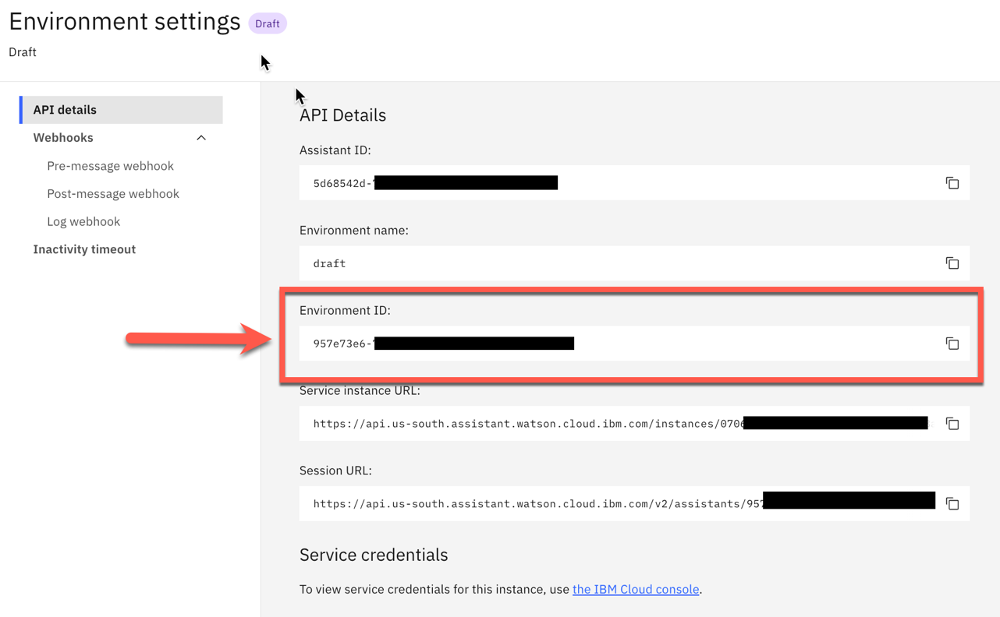
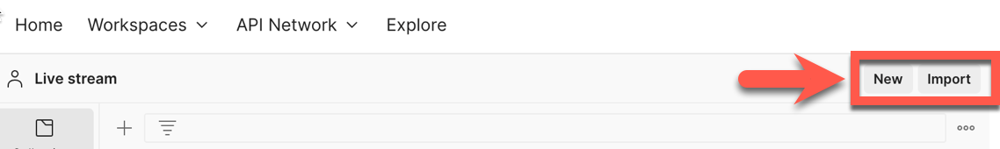
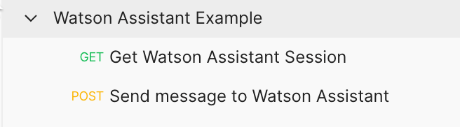
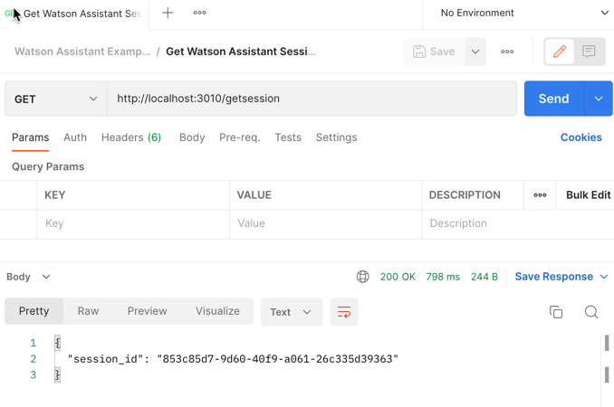
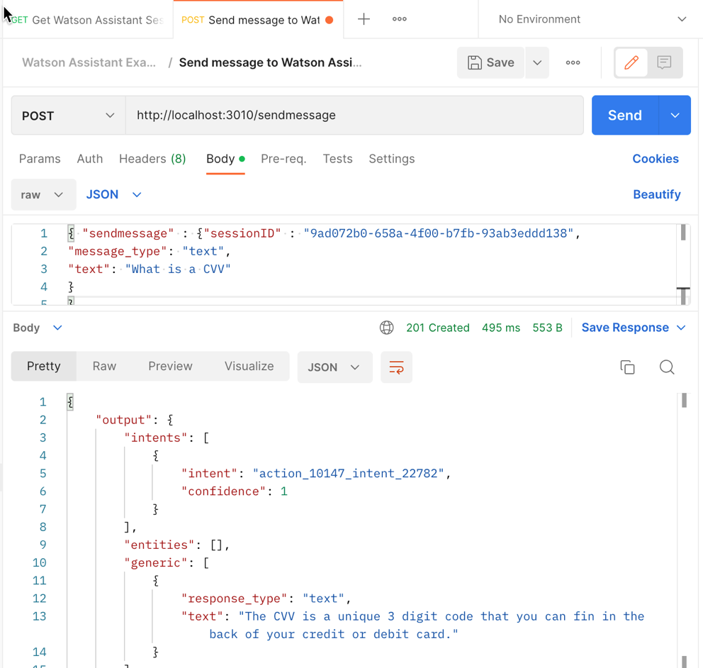

# Simple Node.js server example for using the [Watson Assistant API v2](https://cloud.ibm.com/apidocs/assistant/assistant-v2) 

This is a simple example to use the [Watson Assistant API v2](https://cloud.ibm.com/apidocs/assistant/assistant-v2) with the [Node.js SDK](https://github.com/watson-developer-cloud/node-sdk) to get a [Watson Assistant](https://cloud.ibm.com/catalog/services/watson-assistant#about) sessionID and send a message to [Watson Assistant](https://cloud.ibm.com/catalog/services/watson-assistant#about) using this session ID.

These are the REST endpoints of the simple Node.js server: 

* `GET` getsession
* `POST` sendmessage

The project contains examples for using [Postman](https://www.postman.com/downloads/).

Here are the steps to follow: How to use that example.

### Step 1: Git clone

```sh
git clone https://github.com/thomassuedbroecker/verify-node-js-watson-assistant.git
cd verify-node-js-watson-assistant/code/simple-server
```

### Step 2: Configure the environment variables

[Here we need an `environment ID`. We can find this `ID` in the `Watson Assistant user interface`, by navigating to the `Environments page` and selecting the environment you want to use (such as Draft or Live). Then you open the `environment settings` and copy the value from the appropriate field.](https://cloud.ibm.com/apidocs/assistant/assistant-v2#createsession) (Contains the Link to the IBM Cloud documentation)

The image blow shows the `environment ID` in the [IBM Cloud UI](https://cloud.ibm.com/resources).



We also need an `API key` and a base `URL` from the Credentials.

The image blow shows the `API key` and the `URL` in the [IBM Cloud UI](https://cloud.ibm.com/resources).


* Create `.env` file

```sh
cat .env-template > .env
```

* Configure `.env` file to your needs

```sh
WATSON_ASSISTANT_VERSION='2021-11-27'
WATSON_ASSISTANT_API_KEY='XXXX'
WATSON_ASSISTANT_SERVICE_URL='https://api.us-south.assistant.watson.cloud.ibm.com'
WATSON_ASSISTANT_ENVIRONMENT_ID='XXX'
```

### Step 3: Run local on port 3010

```sh
npm install
npm start
```

### Step 4: Open browser and invoke the get session endpoint

```sh
open http://localhost:3010/getsession
```

* Example output:

```json
{
"session_id": "37d13c72-1643-4add-bee5-574c6fd062dc"
}
```

### Step 5: Import the postman collection into postman

The images shows the import button in postman.



Select the `/postman/watson-assistant-example.postman_collection.json` in the project for the import.

### Step 6: After the import you have a new collection inside your postman

The images shows the imported collection.



### Step 7: Send a message 

### Step 7.1: Send a message  Get the session ID form `GET request` using the `getsession` endpoint



### Step 7.2: Insert the `session ID` into the body of the `POST` request using the `sendmessage endpoint`

This is the json format which is used in the post request sendmessage

```json
{ "sendmessage" : {
  "sessionID" : "XXXX",
  "message_type": "text",
  "text": "Hello"
  }
}
```



